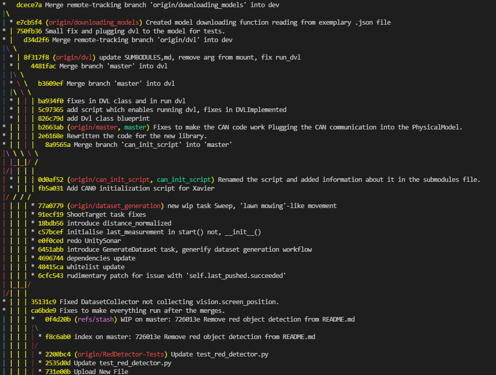
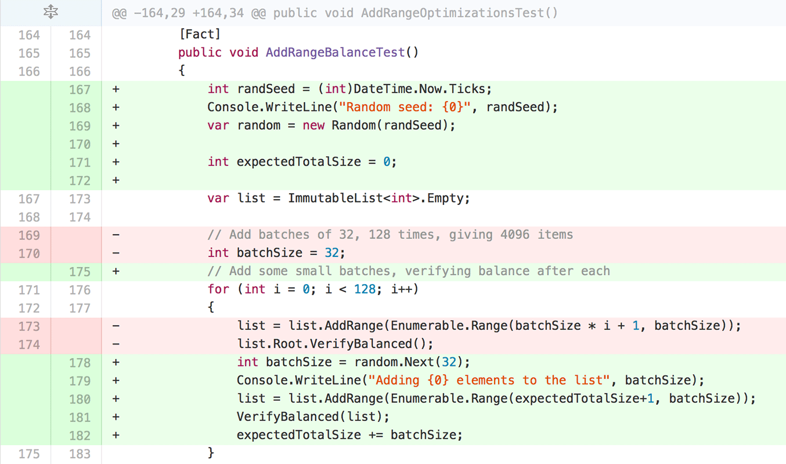

# Działanie git'a

Repozytorium jest reprezentowane przez graf, gdzie wierzchołki to commit'y. 
Każdy commit posiada swój unikalny identyfikator, można je zobaczyć po wywołaniu `git log` i używać z `git checkout <id> .` (kropka jest istotna).

Branch'e to wskaźniki na commit'y.

Git bazuje na algorytmie komendy diff, która porównuje pliki na poziomie linii i stara się znaleźć najoptymalniejsze przekształcenie ze stanu wcześniejszego do obecnego używając operacji dodania i usunięcia linii.

Dla plików możliwe są operacje zmiany zawartości, usunięcia i dodania.

Wnioski: git nie rozumie zmiany nazwy pliku czy syntaktyki języka. Dlatego tak często wychodzą nam merge conflict'y.

Foldery również nie mają znaczenia dla gita, ważne są tylko ścieżki do plików.
