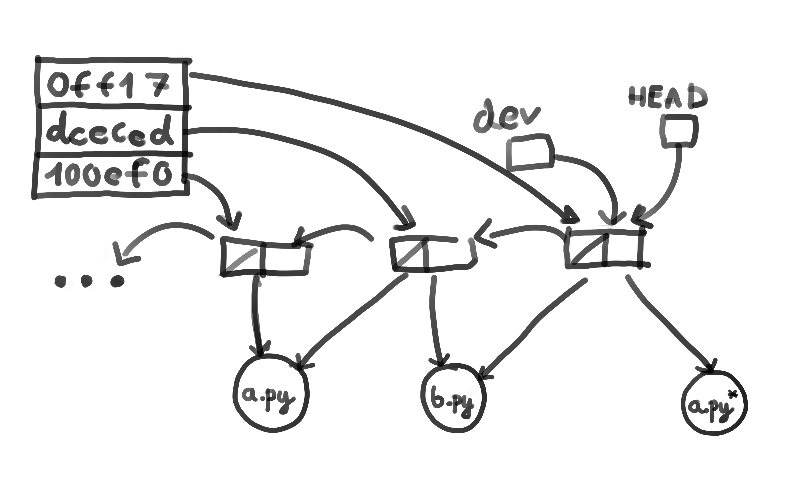

# Działanie git'a

Repozytorium jest reprezentowane przez graf, gdzie wierzchołki to commit'y. Commity zawierają wskaźniki na pliki, które mogą być współdzielone.

Każdy commit posiada swój unikalny identyfikator, można je zobaczyć po wywołaniu `git log` i używać z `git checkout <id> .` (kropka jest istotna).

Branch'e to wskaźniki na commit'y.



Pseudokod dla struktury gita:

```C++
class Repository {
    Branch[] branches;
    Dictionary<int, Commit> hashToCommit;
    Commit* head;
}

class Branch {
    String name;
    Commit* commit;
}

class Commit {
    File* files[];
    Commit* previous[];
}

```


Git bazuje na algorytmie komendy diff, która porównuje pliki na poziomie linii i stara się znaleźć najoptymalniejsze przekształcenie ze stanu wcześniejszego do obecnego używając operacji dodania i usunięcia linii.


Dla plików możliwe są operacje dodania, zmiany zawartości i nazwy oraz usunięcia.
